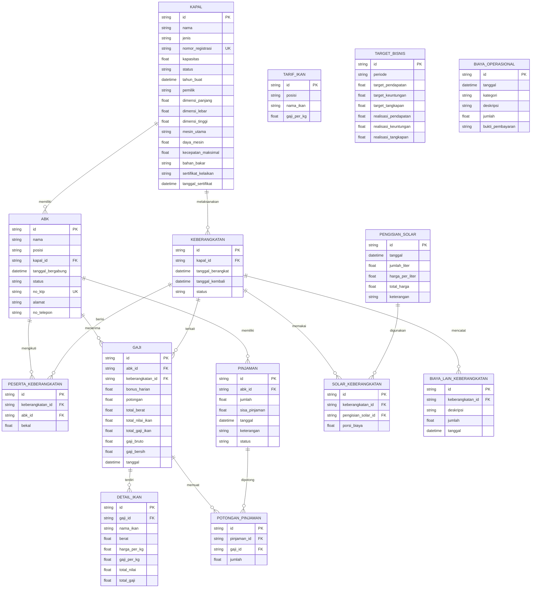
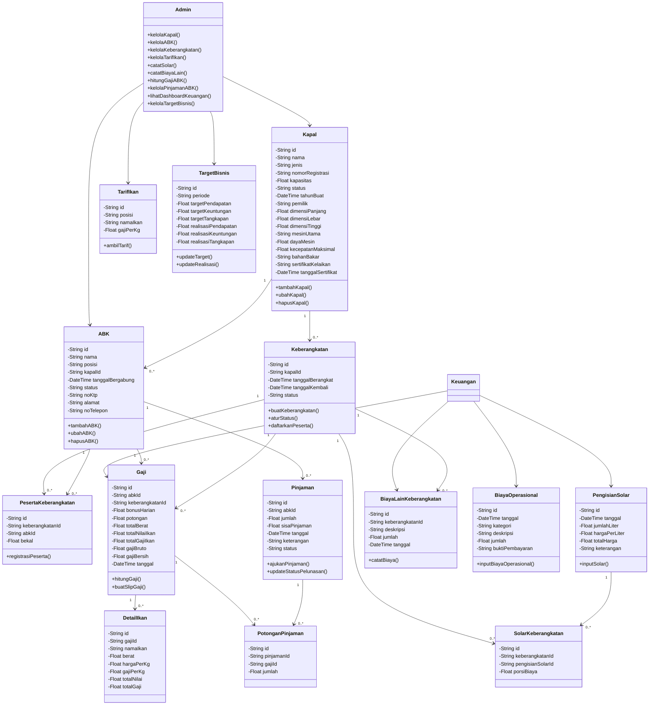
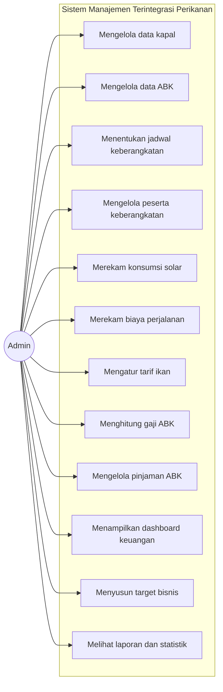
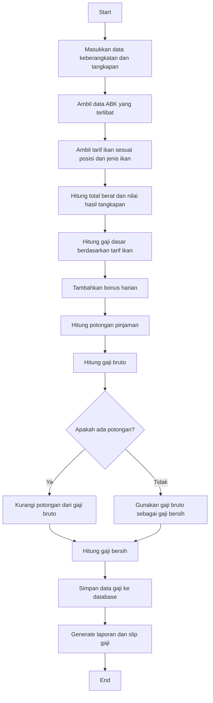
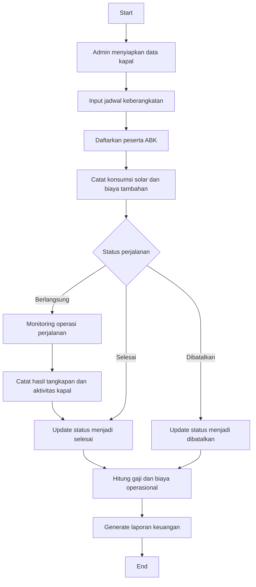

<!-- # UML Aplikasi Manajemen Terintegrasi

Dokumen ini berisi diagram UML untuk aplikasi manajemen operasional dan keuangan perikanan. Diagram dibuat berdasarkan struktur data, fitur utama, dan alur bisnis yang terdapat di aplikasi ini. -->

<!-- ## 1. Overview Aplikasi

Aplikasi ini menangani beberapa domain utama:

- Manajemen kapal
- Manajemen ABK (anak buah kapal)
- Keberangkatan kapal dan peserta
- Pengelolaan solar dan biaya operasional
- Penghitungan gaji berdasarkan tangkapan ikan
- Manajemen pinjaman ABK
- Dashboard keuangan dan target bisnis -->

---

## 1. Entity Relationship Diagram (ERD)

<!-- ### Penjelasan ERD

ERD di atas menggambarkan relasi antar entitas utama dalam sistem manajemen perikanan, yaitu:

- Kapal berhubungan dengan ABK dan Keberangkatan
- Keberangkatan memiliki peserta dan pembiayaan terkait
- ABK menerima gaji dan dapat memiliki pinjaman
- Gaji terdiri atas detail tangkapan ikan dan potongan pinjaman
- Pengisian solar dan biaya lain terkait dengan perjalanan kapal
- TargetBisnis dan BiayaOperasional mendukung analisis keuangan dan performa bisnis -->

---

## 2. Class Diagram

<!-- ### Keterangan formal

Diagram class ini menampilkan struktur sistem secara konseptual, dengan entitas utama, relasi antar kelas, dan operasi yang relevan terhadap proses bisnis. Hubungan yang terdefinisi menunjukkan bagaimana data kapal, awak kapal, perjalanan, penggajian, dan keuangan terintegrasi dalam satu sistem. -->

---

## 3. Use Case Diagram

<!-- ### Interpretasi use case

Use case ini menggambarkan bahwa seluruh operasi sistem dilakukan oleh satu aktor utama, yaitu Admin. Berdasarkan kondisi nyata aplikasi, tidak terdapat aktor lain yang memiliki akses ke sistem, sehingga seluruh fungsi operasional, keuangan, dan pelaporan dijalankan oleh admin secara terintegrasi. -->

---

## 4. Activity Diagram

### 4.1 Activity Diagram: Proses Penghitungan Gaji ABK

### 4.2 Activity Diagram: Proses Keberangkatan Kapal

---

<!-- ## 6. Ringkasan Arsitektur Domain

Sistem ini terdiri atas tiga domain utama, yaitu:

- Operational Domain: kapal, ABK, keberangkatan, peserta, dan konsumsi solar
- Payroll Domain: gaji, detail ikan, tarif ikan, dan potongan pinjaman
- Financial Domain: pinjaman, biaya operasional, target bisnis, dan dashboard keuangan

Dengan pendekatan tersebut, aplikasi mampu mengintegrasikan seluruh siklus operasional kapal mulai dari persiapan pemberangkatan, proses pelayaran, penghitungan gaji, hingga analisis keuntungan dan performa bisnis.

---

## 7. Catatan untuk Laporan Skripsi

Diagram UML ini telah disesuaikan dengan model data sebenarnya pada basis data Prisma dan fitur yang ada di aplikasi. Jika diperlukan, dokumen ini dapat dikembangkan lebih lanjut menjadi:

- Sequence Diagram
- Collaboration Diagram
- UML deployment diagram
- ERD versi formal untuk bab 2 dan 3
- Diagram relasi database untuk tujuan publikasi ilmiah -->
